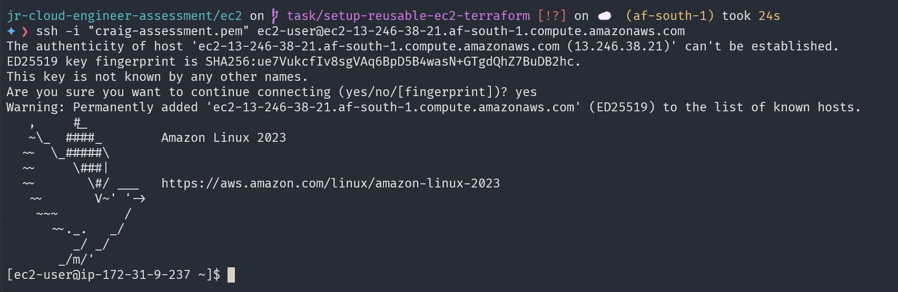
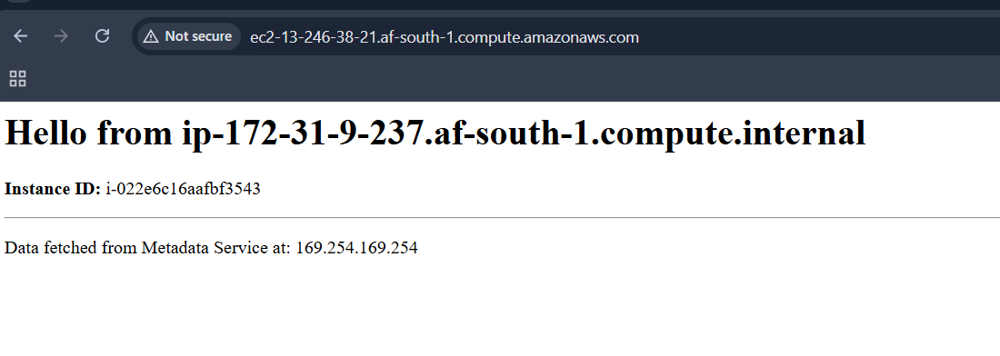

# Reusable EC2

Note: A launch template named jr-assessment-lt was created in the af-south-1 (Cape Town) region via the AWS Management Console to standardize instance configurations.

To deploy an EC2 instance using this template and a custom web server configuration, execute the following command:

```sh
aws ec2 run-instances \
    --launch-template "LaunchTemplateName=jr-assessment-lt" \
    --user-data file://user_data.sh \
    --region af-south-1
```

## Commands Used

### 1. Secure the SSH Key
> Ensure your private key has the correct permissions to prevent SSH rejection.
```sh
chmod 400 "craig-assessment.pem"
```

### 2. Verify Connectivity
> SSH into the instance using its Public DNS to verify the environment:
```sh
ssh -i "craig-assessment.pem" ec2-user@ec2-13-246-38-21.af-south-1.compute.amazonaws.com
```


 
### 3. Verify the Web Server
> Access the public DNS in your browser to confirm the User Data script executed successfully:

- `ec2-13-246-38-21.af-south-1.compute.amazonaws.com`


### 4. Documentation & Versioning
> Export the launch template configuration to a JSON file for version control and auditing:
```sh
aws ec2 describe-launch-template-versions \
    --launch-template-name "jr-assessment-lt" \
    --output json > launch-template-export.json
```

## Key Design Choices

- **AMI** (Amazon Machine Image): **Amazon Linux 2023** was selected for its optimized performance on AWS, smaller footprint, and "security-by-default" approach.

- **Security Group**: Inbound SSH (Port 22) is restricted to a specific IP address to mitigate unauthorized access and brute-force attempts.

- **Decoupled User Data**:

Decision: Instead of embedding the web server configuration directly into the Launch Template, I applied it at the instance level during the run-instances command.

Rationale: This promotes reusability. The same Launch Template can be used for different roles (web server, app server, or database) by simply swapping the `user_data.sh` script.